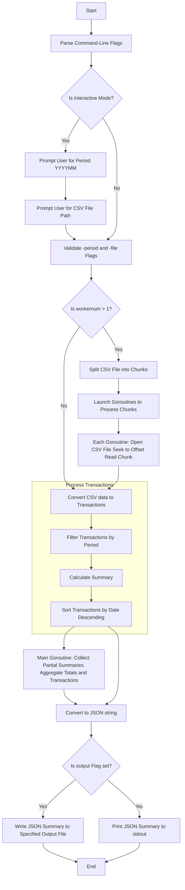

# Transaction History

## Thought Process

- Timeline: With 7 days, I could use the first day only to understand the requirement, prepare some ideas. The next 4 days will focus on design, implement, testing, update document cycle. Finally, in the last 2 days, I will review everything again before the submission.
- Initial understanding:
  - The program is for personal use.
  - The main task of this program is process data to get some kind of knowledge.
- Breakdown the assignment into smaller tasks:
  - Create a command line application which take 2 arguments: the "period" and a path to a file.
  - Read the file content and convert into our program data structure.
  - Main task: process the data to get the result.
  - Show the result in standard output.
  - Other requirements: have a build system, flexible to change the output format, handle all potential errors approriately.
- Prioritize tasks:
  - The core value of this program is the logic to process the data.
  - The second most value of this program is the program structure and module design.
  - The CLI interface, handling input and output should be completed quickly by using common libraries.
  - The build system, github set up should be completed quickly by using online resources.
- I am thinking about having 2 versions, the first one focus on making the program work with simple, short data. The second one will focus on handling with a really big file, large data.
- In the first version, I pipelined the process into steps in which the output of one step will be the input of the next step:
  1. Convert the data in csv file into a list of the program data structure.
  2. Filter the list by the period argument.
  3. Calculate total expense and income, and sort the filtered list.
- The first version is easy to test and understand but it also wastes lots of memory by transfer data between each step, the default sort function is not efficient too. It cannot work with a large dataset.
- In the second version, I intend to improve 2 things:
  - While reading the data, filter by period argument. When building the filtered list, apply insertion sort.
  - Divide the original file into chunks and process each chunk in parallel. Finally, calculate the total and apply merge sort for each chunk transaction list.
- The second version may cost me more time than the given deadline. So, I modify it, keep the most valued part which is ability to split the csv file into chunks and process each chunk parallely. I added a flag to enable this feature, while keep all the logic of the original program.

## Design Decisions

### Programming Language

This assignment request creating a personal program which will evaluate programming and problem solving skill instead of applying technology or system design, in my opinion, the programming language does not matter. Between 2 preferred languages: Go and Java, Go is more famous for system program and CLI application. Go has better performance and more efficient memory management than Java. In addition, I have better advantage using Go.

### Libraries and Frameworks

Standard libraries are good enough to solve the problem:

- `os`, `flag` for commandline interface.
- `encoding/csv`, `encoding/json`, `path/filepath` for handling input and output files.
- `sort`, `strconv`, `strings`, `time` for handling logic filtering, converting, comparing.
- `testing` package would be use for unit test.

Standard libraries are well tested with many online references. I tried to research some open source libraries to improve the performance but it require time to learn about its usage with lacking support from document or community.

### Quality Attributes

There are some attributes which can be suitable for this program:

- Performance: by complete the task efficiently and can handle a large dataset.
- Testability: ability to write test easily with high coverage.
- Modifiability: ability to change the format of input, ouput or extend the program.
- Usability: by providing command, flags, or argument to support multiple features.

Actually, there are 2 ways to execute the program, differentiate by the flag `-workernum`.

The normal way (run without flag `workernum`), will run the program in single execution path (the program main thread) sequentially. It has 3 attributes: testability, modifiability, and usability.

The second way is running the program with flag `workernum` with an integer argument greater than 1. The program will split the input into chunks and process each chunk concurrently with native goroutine and channel. The implementation of concurency model in Go will automatically enable parallel behind the scene. This way my program will replace **testability** attribute with **performance** attribute.

## Requirement Fullfilment

### Completed Requirement Checklist

- [x] Create a CLI application which take 2 inputs: Year and Month (YYYYMM Format) and a path to the file that records the history of wallet deposits and withdrawals.
- [x] Read the file content and process the data to get the result.
- [x] Show the result in standard output with ability to export to file.
- [x] Have a build system using Github Action.
- [x] Have document for the application.

### Challenges

I have been writing personal programs before, but this is the first time I build a complete CLI application. I searched Github open source CLI project in Go to learn about its build process, how it handles flags and arguments.

The real challenge appears when I decided to support a way to handle a really large file. After researching some solutions, they are so complicated that I cannot apply quickly. So I decided to choose only one most valued thing to apply, which is the ability to split the input file into chunks and process it parralel. I didn't micro optimized the original version, so it's simple enough for me to modify and extend for parallel processing.

## Future Work

I do see there are lots of things can be optimized to improve the performance:

- Filtering the transaction while converting it from csv records.
- Reduce using Go `time.Parse` and use integer comparison since we already know about the date format pattern.
- While increasing the transactions slice, we can build a sorted slice instead of sorting it after filtering all transactions.
- With a large input file, can use slice of pointer (data store in heap by default) instead of slice of value (let Go decide data stay in stack or heap). Then applying merge sort while merging all chunk result.

## Diagram

